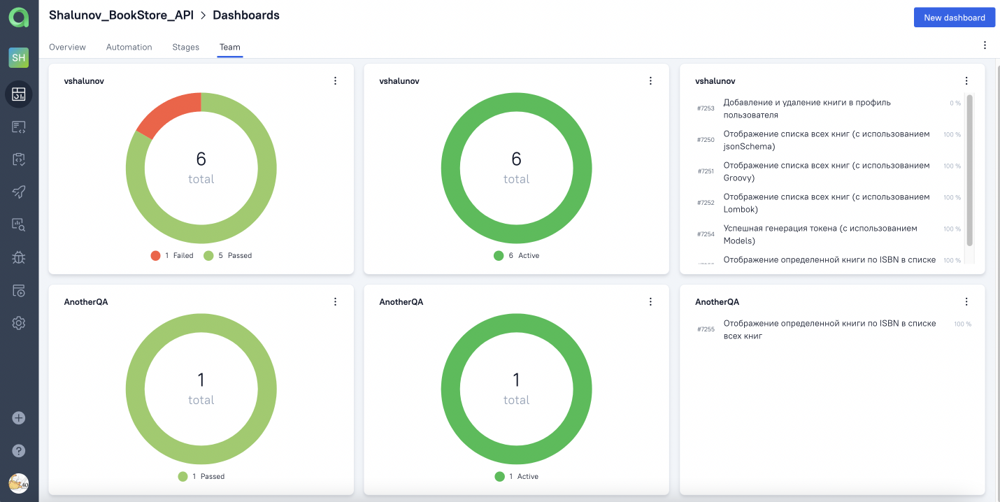

# Проект по автоматизации тестирования API для веб-приложения [Book Store](https://demoqa.com/books)

<p align="center">

</p>

##  Покрытый функционал

### UI
- :white_check_mark: Запросы <code>GET</code>, <code>POST</code> и <code>DELETE</code>
    - :white_check_mark: Успешная генерация токена
    - :white_check_mark: Отображение списка всех книг
    - :white_check_mark: Отображение определенной книги по ISBN в списке всех книг
    - :white_check_mark: Добавление и удаление книги в профиле пользователя
- :white_check_mark: Отображение <code>statusCode</code> и <code>body</code> в ответе запроса
- :white_check_mark: Соответствие <code>body</code> ответа <code>JSON Schema</code>
- :white_check_mark: Отображение значений ключа в соответствии с проверкой на <code>Groovy</code>

##  Технологический стек

<p align="center">


</p>

> В данном проекте автотесты написаны на <code>Java</code> с использованием библиотеки <code>REST Assured</code>
>
> <code>JUnit 5</code> используется для модульного тестирования
>
> <code>Gradle</code> используется для автоматизированной сборки проекта
>
> <code>Jenkins</code> выполняет запуск тестов
>
> <code>Allure Report</code> формирует отчет о запуске тестов
>
> Автотесты интегрируются с тест-менеджмент системой <code>Allure TestOps</code> и таск-трекер системой <code>Jira</code>
>
> В <code>Telegram</code> отправляются уведомления о пройденном прогоне

##  Запуск тестов из терминала

<details>
<summary>Подробнее</summary>

### :rocket: Локальный запуск тестов

```
gradle clean ${task}
```
> <details>
> <summary>:exclamation: Для запуска тестов необходимы файлы, в которых прописаны определенные параметры: </summary>
> <details>
> <summary> <code>api.properties</code> </summary>
>
> + <code>apiUrl</code> – адрес сервера, который будет использоваться в тестах
> </details>
>
> <details>
> <summary> <code>credentials.properties</code> </summary>
>
> + <code>userName</code> – логин пользователя для авторизации в приложении Book Store
> + <code>password</code> – пароль пользователя для авторизации в приложении Book Store
> </details>
> </details>

### :rocket: Параметры сборки

> <details>
> <summary><code>TASK</code> - список тестов, сгруппированных по параметру тега. В зависимости от выбранного параметра, будут запускаться определенные группы тестов</summary>
>
> + <code>test</code> - запуск всех тестов
> + <code>high_priority_tests</code> - запуск тестов с высоким приоритетом
> </details>

</details>

##  Формирование отчета Allure

<details>
<summary>Подробнее</summary>

> <details>
> <summary>:exclamation:</summary>
>
> + Предварительно необходимо установить _Allure_
> </details>

```
allure serve build/allure-results
```

</details>

##  Запуск тестов в [Jenkins](https://jenkins.autotests.cloud/job/Shalunov_BookStore_API/)

<details>
<summary>Подробнее</summary>

### :triangular_flag_on_post:     Для запуска тестов в Jenkins необходимо выполнить следующие шаги:

1. Открыть сборку [Jenkins](https://jenkins.autotests.cloud/job/Shalunov_BookStore_API)
2. Нажать на таск <code>"Собрать с параметрами"</code>
3. Указать [значения параметров](#rocket-параметры-сборки)
4. Нажать на кнопку <code>"Собрать"</code>

<p align="center">

</p>

### :triangular_flag_on_post: Для формирования отчета о прохождении тестов в Allure Report необходимо выполнить следующий шаг:

5. После выполнения сборки нажать на любую ссылку/иконку <code>"Allure Report"</code>

<p>

</p>

</details>

##  Отчет о результатах тестирования в [Allure Report](https://jenkins.autotests.cloud/job/Shalunov_BookStore_API/allure/)

<details>
<summary>Подробнее</summary>

> <code>Allure-framework</code> используется в качестве инструмента для построения отчетов о прогоне автотестов.
> Он позволяет получить информацию о ходе выполнения тестов, а также прикрепить скриншоты, логи и видео к формируемому отчету.
> Имеется возможность указать различные теги, приоритеты и прочую сопутствующую информацию для тестов.

### :dart: Главная страница Allure-отчета

<p align="center">

</p>

### :dart: Информация о тестовом прогоне в графическом виде

<p align="center">

</p>

### :dart: Группировка тестов по проверяемому функционалу

<p align="center">

</p>

</details>

##  Интеграция тестов c тест-менеджмент системой [Allure TestOps](https://allure.autotests.cloud/project/1007/dashboards)

<details>
<summary>Подробнее</summary>

> <code>Allure TestOps</code> - это платформа управления качеством программного обеспечения, объединяющая автоматическое и ручное тестирование, которая позволяет управлять всем, что связано с тестированием, в одном месте.

### :test_tube:     Основной дашборд

<p align="center">

</p>

### :test_tube:     Дашборд для отображения успешности и длительности тестов

<p align="center">

</p>

### :test_tube:     Дашборд по стендам

<p align="center">

</p>

### :test_tube:     Дашборд по членам команды

<p align="center">

</p>

### :test_tube:     Запуски тестов

<p align="center">

</p>

### :test_tube:     Результаты запуска тестов

<p align="center">

</p>

### :test_tube: Сгруппированные тест-кейсы по проверяемому функционалу

<p align="center">

</p>

</details>

##  Интеграция тестов c таск-трекер системой [Jira](https://jira.autotests.cloud/browse/HOMEWORK-326)

<details>
<summary>Подробнее</summary>

> Интеграция с <code>Jira</code> позволяет добавлять в задачи тест-кейсы, запуски и их результаты.

<p align="center">

</p>

</details>

##  Уведомления в Telegram с использованием бота

<details>
<summary>Подробнее</summary>

> Реализована отправка уведомлений о прогоне с помощью бота в <code>Telegram</code>.
> Фреймворк также поддерживает уведомления по _электронной почте, Slack, Skype_ и _Mattermost_.

<p align="center">

</p>

</details>

<details>
<summary>:heartbeat: </summary>

### Спасибо за идею оформления [jjfhj](https://github.com/jjfhj)

</details>


